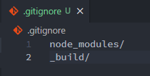
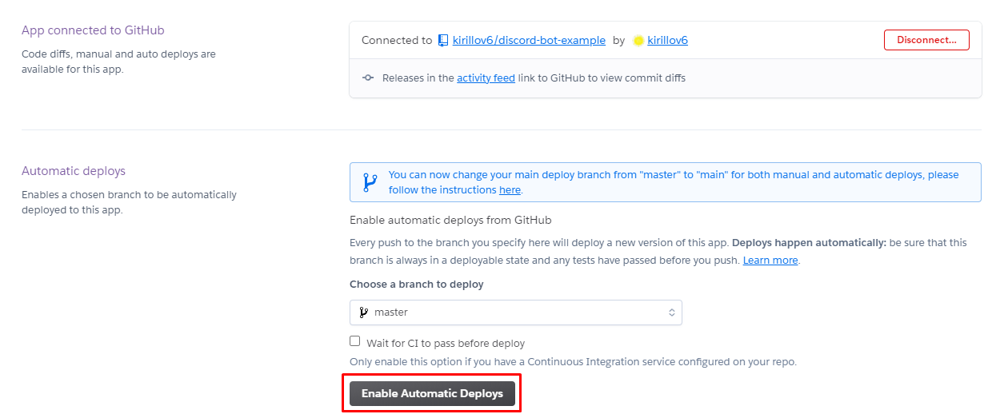

- [Подготовка окружения](#подготовка-окружения)
	- [IDE](#ide)
	- [NodeJS](#nodejs)
	- [Инициализация проекта](#инициализация-проекта)
	- [Node-пакеты](#node-пакеты)
		- [TypeScript](#typescript)
		- [dotenv](#dotenv)
		- [Discord API](#discord-api)
- [Создание бота](#создание-бота)
	- [Регистрация бота](#регистрация-бота)
	- [Добавление бота на сервер](#добавление-бота-на-сервер)
- [Написание кода для работы бота](#написание-кода-для-работы-бота)
	- [Класс AppDiscord](#класс-appdiscord)
		- [Базовый класс](#базовый-класс)
		- [События](#события)
		- [Сообщения](#сообщения)
	- [Точка запуска приложения](#точка-запуска-приложения)
		- [Функция запуска](#функция-запуска)
			- [Параметры клиента](#параметры-клиента)
		- [npm-скрипты](#npm-скрипты)
		- [Первый запуск](#первый-запуск)
	- [Тестирование команд](#тестирование-команд)
	- [Структура проекта](#структура-проекта)
		- [Каталог для событий](#каталог-для-событий)
		- [Каталог для команд](#каталог-для-команд)
		- [Базовый класс](#базовый-класс-1)
	- [Аргументы комманд](#аргументы-комманд)
	- [Описание команд и команда help](#описание-команд-и-команда-help)
		- [Описание команды](#описание-команды)
		- [Команда help](#команда-help)
- [Деплой на Heroku](#деплой-на-heroku)
	- [Публикация бота на GitHub](#публикация-бота-на-github)
	- [Создание приложения на Heroku](#создание-приложения-на-heroku)
		- [Создание приложения](#создание-приложения)
		- [Переменные среды](#переменные-среды)
		- [Конфигурация Dynos](#конфигурация-dynos)

# Подготовка окружения

## IDE
В руководстве будет использоваться [VS Code](https://code.visualstudio.com/), но подойдет любой удобный редактор / IDE.

## NodeJS
Бот будет написан на [NodeJS](https://nodejs.org/en/).
Необходимо [скачать](https://nodejs.org/en/download/) и установить последнюю версию с официального сайта.

После установки необходимо проверить, что NodeJS корректо установлен. Для этого проверим версию, выполнив в терминале `node -v`:\


Если версия отображается корректно - установка прошла успешно.

## Инициализация проекта
Создадим новый каталог **tutorial-bot** и перейдем в него:\


Теперь мы можем использовать [npm](https://www.npmjs.com/) (Node package manager) для инициализации нашего проекта (пакета). Для этого выполним в терминале `npm init -y` (флаг -y позволяет автоматически соглашаться на все разрешения, которые будут в процессе инициализации пакета):\


Если пакет инициализировался успешно - мы увидим содержимое созданного файла [package.json](https://docs.npmjs.com/cli/v7/configuring-npm/package-json), который содержит информацию о нашем пакете.

После этого инициализируем [git](https://git-scm.com/)-репозиторий, выполнив команду `git init`:\


Создадим файл **.gitignore**, выполнив команду `touch .gitignore`, который позже заполним списком файлов/каталогов, которые необходимо игнорировать:\


На этом инициализацию проекта можно считать завершенной. Теперь мы можем открыть созданный каталог в VS Code и увидеть текущее содержимое нашего проекта:\


## Node-пакеты
### TypeScript
Мы не будем использовать ванильный JS, а будем использовать [TypeScript](https://www.typescriptlang.org/), т.к. статическая типизация позволяет отлавливать ошибки на этапе написания кода / компиляции, тем самым сокращая количество ошибок во время выполнения. Так же, как бонус, IntelliSense работает лучше с TypeScript'ом - нет необходимости залазить в API пакетов.

Установим пакет **typescript**, выполнив команду `npm i typescript`:\


После установки пакета можно увидеть, что добавилась зависимость в файле **package.json**, а также появился каталог **node_modules**.

Каталог **node_modules** содержит все исходные и бинарные файлы зависимостей, которые не нужны в нашем репозитории. Добавим этот каталог в файл **.gitignore**:\


Когда другой разработчик склонирует наш репозиторий, он сможет выполнить установку всех необходимых пакетов через команду `npm i`, т.к. все они будут прописаны в **package.json**.

Дополнительно установим пакет **@types/node**, который содержит все типы NodeJS, выполнив команду `npm i -D @types/node` (флаг -D это сокращение для флага --save-dev, который позволяет установить пакет как зависимость для разработки):\


Для настройки конфигурации **typescript компилятора (tsc)** используется файл [tsconfig.json](https://www.typescriptlang.org/docs/handbook/tsconfig-json.html). Создадим этот файл в корне проекта со следующим текстом:
```json
{
    "compilerOptions": {
        "module": "commonjs",
        "target": "es2017",
        "noImplicitAny": false,
        "outDir": "_build",
        "emitDecoratorMetadata": true,
        "experimentalDecorators": true,
        "importHelpers": true,
        "forceConsistentCasingInFileNames": true,
        "lib": [
            "es2017",
            "esnext.asynciterable"
        ],
        "moduleResolution": "node"
    },
    "exclude": [
        "node_modules"
    ]
}
```

Здесь параметр **outDir** отвечает за папку, в которую будут скомпилированы *.ts файлы (файлы будут в формате *.js). Эта папка не нужна в нашем репозитории, поэтому добавим ее в **.gitignore**:\



### dotenv
Для работы с файлом .env, который определяет переменные окружения, необходимо установить пакет **dotenv**, выполнив команду `npm i dotenv`.

Создадим файл **.env** в корне проекта и добавим его в **.gitignore**, т.к. в нем будет приватная информация по типу токенов, паролей и т.п. Его мы заполним позже, когда появятся переменные.\
Также, хорошей практикой является создание файла **.env.example**, который будет копией файла **.env**, но переменные будут без значений. Это позволит не добавлять файл **.env.example** в **.gitignore**, и любой разработчик, работающий с вашим проектом, будет знать, какие переменные окружения используются, чтобы заполнить их своими значениями.\


### Discord API
Для работы с Discord API будем использовать [discord.js](https://discord.js.org/) в связке с [@typeit/discord](https://owencalvin.github.io/discord.ts/), который позволяет работать с API на typescript.

Установим эти пакеты, выполнив команду `npm i discord.js @typeit/discord`. Также нам нужно установить некоторые зависимости **@typeit/discord** - `npm i -D tslib`.

# Создание бота
## Регистрация бота
Для начала необходимо зарегистрировать бота на портале разработчиков Discord.
1. Авторизуемся на сайте [Discord](https://discord.com/).
2. Переходим на [портал разработчиков](https://discord.com/developers/applications) и нажимаем **New Application**:\

3. Заполняем имя нашего нового "приложения" и нажимаем **Create**:\

4. После этого переходим во вкладку **Bot** и нажимаем **Add Bot**:\


На этом регистрация бота завершена. Теперь мы можем настроить аватар и имя нашего бота:\


Сохраним токен, по которому наш бот будет авторизовываться на серверах, в файле **.env**:
1. Копируем токен, нажав кнопку **Copy**:\

2. Открываем файл **.env**, добавляем переменную **DISCORD_TOKEN** и присваиваем ей значение скопированного токена:\

3. Добавим такую же переменную без значения в файл **.env.example**:\


## Добавление бота на сервер
1. Переходим во вкладку **OAuth2** на портале разработчиков и ставим чекбокс **bot**:\

2. Добавляем разрешения для бота (позже их можно будет изменить на сервере) и нажимаем **Copy**:\

3. Вставляем скопированную ссылку в браузере, выбираем сервер и нажимаем **Продолжить**:\


Бот успешно присоединился к нашему серверу:\


# Написание кода для работы бота
## Класс AppDiscord
### Базовый класс
Создадим в корне проекта файл **AppDiscord.ts** со следующим кодом:
```ts
import {
	Discord
} from '@typeit/discord';

@Discord() 
export abstract class AppDiscord {

}
```

Здесь мы импортируем необходимые элементы из пакета **@typeit/discord** и описываем основной класс, реализующий логику работы нашего бота. В этом поможет декоратор **@Discord**, который говорит о том, что это - наш основной класс.

Вся работа с **@typeit/discord** ведется через декораторы, которые ускоряют и упрощают процесс написания кода.

Декоратор **@Discord** имеет параметр **prefix**, который позволяет боту игнорировать все сообщения на сервере, которые начинаются не с этого префикса. Добавим префикс:
```ts
import {
	Discord
} from '@typeit/discord';

@Discord('!')
export abstract class AppDiscord {

}
```

Подобные параметры лучше хранить в одном месте, поэтому создадим в корне проекта конфигурационный файл **config.json**, в котором будем описывать различные публичные параметры. Добавим в него следующий текст:
```json
{
	"prefix": "!"
}
```

Теперь мы можем импортировать префикс из конфигурационного файла и заменить константу на значение из файла:
```ts
import {
	Discord
} from '@typeit/discord';

const { prefix } = require('./config.json');

@Discord(prefix) 
export abstract class AppDiscord {

}
```

### События
Теперь мы можем перейти к заполнению класса обработчиками событий, которые будут выполняться каждый раз, когда Discord будет генерировать какое-либо событие. В этом нам поможет декоратор **@On**.

Декоратор **@On** имеет формат  `@On(event: string)`, где **event** - имя события. Полный список событий и их аргументов можно найти [здесь](https://github.com/OwenCalvin/discord.ts#the-argument-list).

Добавим обработчики событий **ready** (вызывается сразу после того, как бот авторизовался на сервере) и **message** (вызывается, когда отправляется сообщение, начинающееся с префикса):
```ts
import {
	Discord,
	On
} from '@typeit/discord';

const { prefix } = require('./config.json');

@Discord(prefix) 
export abstract class AppDiscord {
	@On('ready')
	private onReady() {

	}

	@On('message')
	private onMessage() {

	}
}
```

Для получения списка аргументов события воспользуемся рефлексией, которую предоставляет `ArgsOf<Event>`. Помимо аргументов, мы можем получить инстанс клиента. Добавим это в наш код:
```ts
import {
    Discord,
    Client,
    On,
    ArgsOf
} from '@typeit/discord';

const { prefix } = require('./config.json');

@Discord(prefix) 
export abstract class AppDiscord {
    @On('ready')
    private onReady(
        []: ArgsOf<'ready'>,
        client: Client
    ) {

    }

    @On('message')
    private onMessage(
        [message]: ArgsOf<'message'>,
		client: Client
    ) {

    }
}
```

Теперь мы можем написать тело функций. В событие **onReady** добавим установку статуса клиента, а в событие **onMessage** - вывод сообщения в консоль и последующее удаление отправленного (не ботом) сообщения с задержкой в 5 секунд, чтобы не засорять канал:
```ts
import {
	Discord,
	Client,
	On,
	ArgsOf
} from '@typeit/discord';

const { prefix } = require('./config.json');

@Discord(prefix) 
export abstract class AppDiscord {
	@On('ready')
	private onReady(
		[]: ArgsOf<'ready'>,
		client: Client
	) {
		client.user.setActivity('Create tutorial bot', { type: 'STREAMING'});
	}

	@On('message')
	private onMessage(
		[message]: ArgsOf<'message'>,
		client: Client
	) {
		console.log(`${message.author.tag}: ${message.content}`);

		if (message.author.id != client.user.id)
			message.delete({timeout: 5000});
	}
}
```

### Сообщения
**@typeit/discord** позволяет построить гибкую систему обработки сообщений. Для этого используются 2 декоратора: **@Command** и **@CommandNotFound**, имеющие формат `@Command(commandName: string)` и `@CommandNotFound()` соответственно.

Декоратор **@CommandNotFound** позволяет обработать ситуацию, когда пользователь пытается использовать команду, которую бот не поддерживает.

Декоратор **@Command** позволяет добавить обработчик для определенной команды, учитывая префикс, который устанавливается в декораторе **@Discord**. Рассмотрим 2 примера:
```ts
@On('message')
private onMessage(
	[message]: ArgsOf<'message'>
) {
	if (message.content == 'ping')
		message.reply('pong');
}
```
и
```ts
@Command('ping')
private ping(message: CommandMessage) {
	message.reply('pong');
}
```

Предоставленные примеры отработают одинаково, но пример, использующий декоратор **@Command** выглядит понятнее и чище - он обрабатывает поведение для конкретной команды, в то время как пример, использующий декоратор **@On**, обрабатывает все сообщения, и приходится проверять какая именно команда отправлена.

Добавим в наше приложение обработчик команды **ping** и обработчик ситуации, когда команда не поддерживается:
```ts
import {
	Discord,
	Client,
	On,
	ArgsOf,
	Command,
	CommandMessage,
	CommandNotFound
} from '@typeit/discord';

const { prefix } = require(`./config.json`);

@Discord(prefix) 
export abstract class AppDiscord {
	@On('ready')
	private onReady(
		[]: ArgsOf<'ready'>,
		client: Client
	) {
		client.user.setActivity('Create tutorial bot', { type: 'STREAMING'});
	}

	@On('message')
	private onMessage(
		[message]: ArgsOf<'message'>,
		client: Client
	) {
		console.log(`${message.author.tag}: ${message.content}`);

		if (message.author.id != client.user.id)
			message.delete({timeout: 5000});
	}

	@Command('ping')
	private ping(message: CommandMessage) {
		message.reply('pong');
	}

	@CommandNotFound()
	private notFound(message: CommandMessage) {
		message.reply('command not found')
		.then(msg => {
			msg.delete({timeout: 5000});
		});
	}
}
```

На этом базовая логика работы бота готова, теперь можем перейти к точке запуска нашего приложения.

## Точка запуска приложения
### Функция запуска
Создадим в корне проекта файл **bot.ts** со следующим кодом:
```ts
import './AppDiscord';
import { Client } from '@typeit/discord';

require('dotenv').config();

async function run() {
	const client = new Client({
		classes: [
			`${__dirname}/*Discord.[jt]s`
		],
		variablesChar: ':'
	});

  await client.login(process.env.DISCORD_TOKEN);
}

run();
```

В данном файле описана функция, инициализирующая клиент нашего бота и выполняющая подключение его на сервера Discord, используя ранее сохраненный токен.

1. Импортируем класс базового клиента
2. Инициализируем переменные среды (файл **.env**)
3. Создаем клиент бота
4. Подключаемся на сервер

#### Параметры клиента
* **classes** - пути до файлов, содержащих главные классы приложения
* **variablesChar** - символ, через который мы сможем объявлять переменные внутри декораторов

### npm-скрипты
Для удобства запуска нашего приложения добавим в **package.json** несколько полезных скриптов:
```json
"scripts": {
	"clean": "rm -Rf ./_build",
	"build": "npm run clean && tsc && cp ./config.json ./_build/config.json",
	"start": "npm run build && node ./_build/bot.js"
}
```
* **clean** - очищает сборочную папку
* **build** - собирает приложение (очищает сборочную папку, компилирует *.ts файлы в *.js файлы и копирует конфиг в сборочную папку)
* **start** - выполняет сборку и запуск приложения

### Первый запуск
Теперь мы готовы к первому запуску нашего приложения. Для этого в терминале введем команду `npm start`:\


Здесь мы можем увидеть, как выполняются скрипты, и после этого получаем список всех событий и команд, которые поддерживает бот.

Если мы заглянем на сервер, то увидим, что бот стал онлайн, и он имеет статус, который мы установили в событии **ready**:\


## Тестирование команд
Теперь мы можем протестировать нашу команду **ping**, а также обработчик неподдерживаемых команд.

Отправим команду `!ping`:\


Мы успешно получили ответное сообщение от бота. Спустя 5 секунд наше отправленное сообщение удалится и останется только ответ бота:\


Если мы заглянем в консоль, то увидим лог нашего общения с ботом:\


Теперь попробуем отправить команду, которая не поддерживается ботом:\


Получили ожидаемый ответ. Спустя 5 секунд удалится отправленное сообщение, а также ответ бота:\


## Структура проекта
При текущем подходе по мере добавления новых обработчиков и команд наш базовый класс будет быстро расти и превратится в огромного монстра. Чтобы этого не произошло изменим структуру нашего проекта - вынесем все обработчики и команды в отдельные файлы.

### Каталог для событий
Создадим в корне проекта каталог **events**. 

В каталоге **events** создадим файл **Ready.ts** со следующим кодом:
```ts
import {
	Client,
	On,
	ArgsOf
} from '@typeit/discord';

export abstract class Ready {

}
```

Теперь мы можем перенести событие **onReady** в созданный класс **Ready**:
```ts
import {
	Client,
	On,
	ArgsOf
} from '@typeit/discord';

export abstract class Ready {
	@On('ready')
	private onReady(
		[]: ArgsOf<'ready'>,
		client: Client
	) {
		client.user.setActivity('Create tutorial bot', { type: 'STREAMING'});
	}
}
```

Проделаем аналогичное с событием **onMessage**, создав файл **Message.ts** и заполнив его:
```ts
import {
	Client,
	On,
	ArgsOf
} from '@typeit/discord';

export abstract class Message {
	@On('message')
	private onMessage(
		[message]: ArgsOf<'message'>,
		client: Client
	) {
		console.log(`${message.author.tag}: ${message.content}`);

		if (message.author.id != client.user.id)
			message.delete({timeout: 5000});
	}
}
```

### Каталог для команд
Создадим в корне проекта каталог **commands**. 

В каталоге **commands** создадим файл **Ping.ts** со следующим кодом:
```ts
import {
	Command,
	CommandMessage
} from '@typeit/discord';

export abstract class Ping {
	@Command('ping')
	private ping(message: CommandMessage) {
		message.reply('pong');
	}
}
```
---
*В каждом классе не обязательно должна быть только одна команда/событие, можно группировать их по классам.*

### Базовый класс
Теперь наш базовый класс выглядит гораздо приятнее:
```ts
import {
	Discord,
	CommandMessage,
	CommandNotFound
} from '@typeit/discord';

const { prefix } = require(`./config.json`);

@Discord(prefix) 
export abstract class AppDiscord {
	@CommandNotFound()
	private notFound(message: CommandMessage) {
		message.reply('command not found')
		.then(msg => {
			msg.delete({timeout: 5000});
		});
	}
}
```

Осталось лишь импортировать вынесенные команды и события в базовый класс. Для этого у декоратора **@Discord** есть параметр **import**, с помощью которого мы можем импортировать все необходимые файлы:
```ts
import {
	Discord,
	CommandMessage,
	CommandNotFound
} from '@typeit/discord';

import * as path from 'path';

const { prefix } = require(`./config.json`);

@Discord(prefix, {
	import: [
		path.join(__dirname, 'commands', '*.[jt]s'),
		path.join(__dirname, 'events', '*.[jt]s')
	]
}) 
export abstract class AppDiscord {
	@CommandNotFound()
	private notFound(message: CommandMessage) {
		message.reply('command not found')
		.then(msg => {
			msg.delete({timeout: 5000});
		});
	}
}
```

## Аргументы комманд
**@typeit/discord** предоставляет возможность описывать аргументы команды в декораторе **@Command**, используя символ **":"** (или любой другой, который задается параметром [variablesChar](#параметры-клиента) при создании клиента).

Создадим в каталоге **commands** новый файл **Calculator.ts** со следующим кодом:
```ts
import {
	Command,
	CommandMessage
} from '@typeit/discord';

export abstract class Calculator {
	@Command('sum')
	private sum(message: CommandMessage) {
		
	}

	@Command('dif')
	private dif(message: CommandMessage) {
		
	}
}
```

Для сложения и вычитания нам нужно 2 аргумента, добавим их:
```ts
import {
	Command,
	CommandMessage
} from '@typeit/discord';

export abstract class Calculator {
	@Command('sum :arg1 :arg2')
	private sum(message: CommandMessage) {
		
	}

	@Command('dif :arg1 :arg2')
	private dif(message: CommandMessage) {
		
	}
}
```

*Если аргумент является **числом**, то его значение преобразуется в тип **number** автоматически.*

Получить значения параметров можно либо напрямую по имени, либо используя деструктуризацию языка js:
```ts
import {
	Command,
	CommandMessage
} from '@typeit/discord';

export abstract class Calculator {
	@Command('sum :arg1 :arg2')
	private sum(message: CommandMessage) {
		const myArg1 = message.args.arg1;
        const myArg2 = message.args.arg2;
	}

	@Command('dif :arg1 :arg2')
	private dif(message: CommandMessage) {
		const { arg1, arg2 } = message.args;
	}
}
```

Добавим тело функций:
```ts
import {
	Command,
	CommandMessage
} from '@typeit/discord';

export abstract class Calculator {
	@Command('sum :arg1 :arg2')
	private sum(message: CommandMessage) {
        const myArg1 = message.args.arg1;
        const myArg2 = message.args.arg2;

        if ((typeof myArg1 === 'number') && (typeof myArg2 === 'number'))
            message.reply(`${myArg1} + ${myArg2} = ${myArg1 + myArg2}`);
        else
            message.reply('bad arguments');
	}

    @Command('dif :arg1 :arg2')
	private dif(message: CommandMessage) {
		const { arg1, arg2 } = message.args;

        if ((typeof arg1 === 'number') && (typeof arg2 === 'number'))
            message.reply(`${arg1} - ${arg2} = ${arg1 - arg2}`);
        else
            message.reply('bad arguments');
	}
}
```

Протестируем новые команды:\


## Описание команд и команда help
### Описание команды
Мы можем добавить описание команды, используя дескриптор **@Description**. Это поможет сделать код читабильнее, а также поможет в реализации команды **help**, которая будет выводить список всех доступных команд с их описанием.

Добавим описание команды **ping**:
```ts
import {
	Command,
	CommandMessage,
	Description
} from '@typeit/discord';

export abstract class Ping {
	@Command('ping')
	@Description('отвечает "pong"')
	private ping(message: CommandMessage) {
		message.reply('pong');
	}
}
```

### Команда help
Теперь добавим команду **help**. Создадим в каталоге **commands** файл **Help.ts** со следующим кодом:
```ts
import {
    Client,
	Command,
	CommandMessage,
	Description
} from '@typeit/discord';

export abstract class Help {
	@Command('help')
	@Description('выводит список доступных команд')
	private help(message: CommandMessage) {
		var commands = Client.getCommands();
        var cmdMap = new Map<string, string>();
        for (let i = 0; i < commands.length; ++i) {
            let cmd = commands[i];
            cmdMap.set(cmd.commandName.toString(), cmd.description ?? ':thinking:');
        }

        var helpList = 'Список доступных команд:\n';
        for (let cmd of cmdMapSorted.entries())
            helpList += `**${cmd[0]}** - ${cmd[1]}\n`;

        message.channel.send(helpList);
	}
}
```

1. Получаем список всех команд, поддерживаемых ботом (в этом поможет метод `getCommands()` класса **Client**).
2. Проходим по списку команд и заполняем карту значениями <Имя, Описание> (если описание отсутствует - вставляем эмоджи).
3. Формируем итоговое сообщение со списком команд и их описаниями из заполненной карты.
4. Отправляем сообщение на сервер.

Запустим бота и проверим, отправив команду **!help**:\


У команд **sum** и **dif** присутствуют аргументы, которые мы бы хотели выводить в другом формате. Добавим в код обработку аргументов:
```ts
import {
    Client,
	Command,
	CommandMessage,
	Description
} from '@typeit/discord';

export abstract class Help {
	@Command('help')
	@Description('выводит список доступных команд')
	private help(message: CommandMessage) {
        var commands = Client.getCommands();
        var cmdMap = new Map<string, string>();
        for (let i = 0; i < commands.length; ++i) {
            let cmd = commands[i];

            let cmdSignature= cmd.commandName.toString().split(' ');
            let cmdName = cmdSignature.shift();

            let cmdSignatureLen = cmdSignature.length;
            if (cmdSignatureLen > 0) {
                cmdName += ' [';
                for (let j = 0; j < cmdSignatureLen; ++j) {
                    cmdName += `${cmdSignature[j].replace(Client.variablesChar, '')}`;
                    if (j < cmdSignatureLen - 1)
                        cmdName += ', ';

                }
                cmdName += ']';
            }

            cmdMap.set(cmdName, cmd.description ?? ':thinking:');
        }

        var helpList = 'Список доступных команд:\n';
        for (let cmd of cmdMapSorted.entries())
            helpList += `**${cmd[0]}** - ${cmd[1]}\n`;

        message.channel.send(helpList);
	}
}
```

1. Разбиваем полное имя команды, влючающее аргументы, на массив элементов.
2. Получаем имя команды, удаляя его при этом из массива (спасибо методу `shift()`).
3. Если в массиве остались элементы (аргументы), то перечислим их в квадратных скобках, удаляя при этом символ [variablesChar](#параметры-клиента).

Запустим бота и проверим, отправив команду **!help**:\


Теперь можем убрать из этого списка команду **help** и отсортировать по алфавиту:
```ts
import {
    Client,
	Command,
	CommandMessage,
	Description
} from '@typeit/discord';

export abstract class Help {
	@Command('help')
	@Description('выводит список доступных команд')
	private help(message: CommandMessage) {
        var commands = Client.getCommands();
        var cmdMap = new Map<string, string>();
        for (let i = 0; i < commands.length; ++i) {
            let cmd = commands[i];

            let cmdSignature = cmd.commandName.toString().split(' ');
            let cmdName = cmdSignature.shift();
            
            if (cmdName === 'help')
                continue;

            let cmdSignatureLen = cmdSignature.length;
            if (cmdSignatureLen > 0) {
                cmdName += ' [';
                for (let j = 0; j < cmdSignatureLen; ++j) {
                    cmdName += `${cmdSignature[j].replace(Client.variablesChar, '')}`;
                    if (j < cmdSignatureLen - 1)
                        cmdName += ', ';

                }
                cmdName += ']';
            }

            cmdMap.set(cmdName, cmd.description ?? ':thinking:');
        }

        cmdMap = new Map([...cmdMap.entries()].sort());

        var helpList = 'Список доступных команд:\n';
        for (let cmd of cmdMap.entries())
            helpList += `**${cmd[0]}** - ${cmd[1]}\n`;

        message.channel.send(helpList);
	}
}
```

Запустим бота и проверим, отправив команду **!help**:\


# Деплой на Heroku
## Публикация бота на GitHub
Прежде всего нам нужно опубликовать наш репозиторий.
1. Регистрируемся на [GitHub](https://github.com/).
2. На главной странице в разделе репозиториев нажимаем **New**:\

3. Заполняем все необходимые данные и нажимаем **Create repository**:\

4. Делаем первый коммит любым удобным способом (VS Code, GitHub Desktop, терминал).
5. В терминале вводим команду `git remote add origin {link}` с ссылкой на созданный репозиторий:\


6. Пушим наши изменения на сервер с помощью команды `git push -u origin master`:

7. Проверяем, что наши файлы попали в репозиторий:\
 

## Создание приложения на Heroku
### Создание приложения
Для начала работы необходимо создать приложение.
1. Регистрируемся на [Heroku](https://heroku.com).
2. Переходим на [доску приложений](https://dashboard.heroku.com/apps) и нажимаем **New**->**Create new app**:\

3. Заполняем имя приложения, выбираем регион **Europe** и нажимаем **Create app**:\

4. В настройках профиля, в разделе **Applications** добавляем подключение к нашему аккаунту на **GitHub**:\

5. Переходим в раздел **Deploy** приложения, выбираем **Deployment method** - **GitHub**, вводим в строке поиска имя нашего репозитория и нажимаем **Search**. В списке найденных выбираем нужный репозиторий и нажимаем **Connect**:\

6. После подключения к репозиторию мы можем выбрать автоматический деплой для нужной ветки (будет происходить при новых коммитах в ветку):\


### Переменные среды
Для того, чтобы наше приложение работало корректно, необходимо добавить все переменные среды, которые мы использовали в файле **.env**.
1. Переходим в раздел **Settings** нашего приложения и нажимаем **Reveal Config Vars**:\

1. Заполняем имя и значение переменной **DISCORD_TOKEN** из файла **.env** и нажимаем **Add**:\


### Конфигурация Dynos
Dynos - команды/скрипты, которые определяются в конфигурационном файле Procfile.
Каждый из них выполняется в своем процессе, поэтому они могут использоваться параллельно. Проще говоря это "рабочие", выполняющие наши задачи.

Добавим в корень проекта файл Procfile со следующим текстом:\


Здесь мы описали новый **dyno** с именем **worker**, который будет выполнять наш скрипт `npm start` каждый раз, когда будет происходить деплой нашего приложения.

Запушим этот файл в репозиторий на GitHub.

Если мы перейдем в раздел  **Overview** нашего приложения на **Heroku**, то увидим добавленный **dyno** с именем **worker**, а также работающий **dyno** с именем **web**, который инициализируется автоматически и является дефолтным:\


Дефолтный **dyno** делает тоже самое, но мы все же будем использовать свой, чтобы при необходимости можно было его отредактировать.

Перейдем в раздел **Configure Dynos** и включим нашего **worker**, а **web** - выключим:\


Теперь мы можем перейти на наш Discord-сервер и убедиться, что бот онлайн и отвечает на все команды.